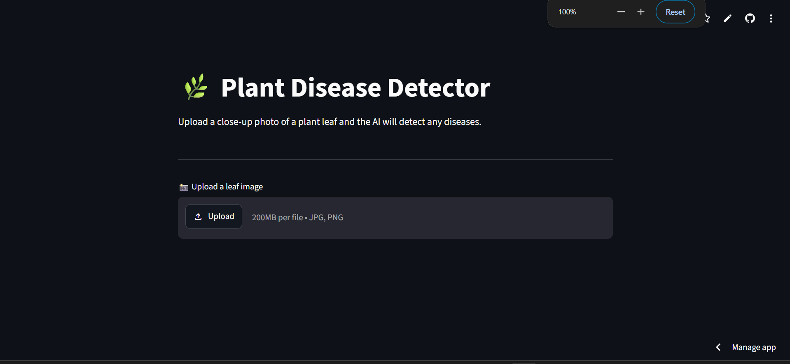
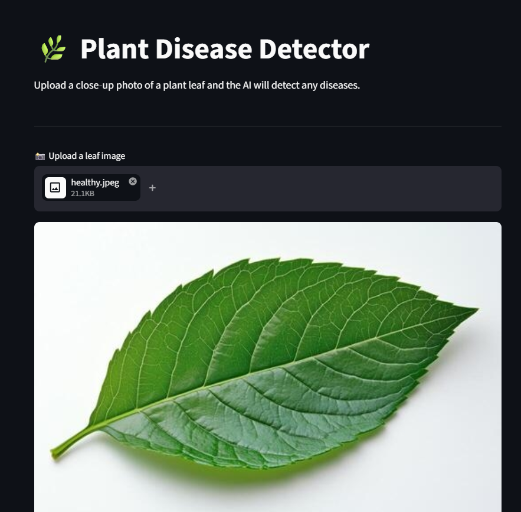
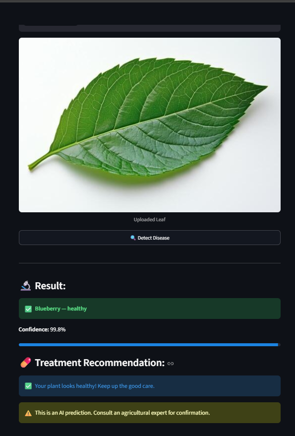
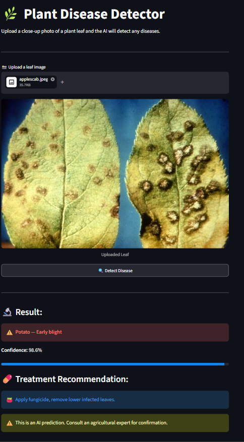

# 🌿 Plant Disease Detector

A deep learning web application that detects plant diseases from leaf images using transfer learning with ResNet50, trained on the PlantVillage dataset.

🔗 **Live App:** https://plant-disease-detector-g5fmyr7famdbcouqfuhfeo.streamlit.app/

---

## 🖥️ Screenshots

### Homepage


### Upload Leaf Image


### Healthy Leaf Detection


### Disease Detection + Treatment


---

## 🎯 Features

- Detects **38 plant disease classes** across 14 plant species
- **95.9% validation accuracy** on PlantVillage dataset
- Treatment recommendations for every detected disease
- Clean, simple UI — just upload and detect
- Deployed live on Streamlit Cloud

---

## 🌱 Supported Plants & Diseases

| Plant | Diseases Detected |
|---|---|
| Tomato | Early Blight, Late Blight, Leaf Mold, Septoria, Spider Mites, Target Spot, Mosaic Virus, Yellow Leaf Curl |
| Apple | Apple Scab, Black Rot, Cedar Apple Rust |
| Potato | Early Blight, Late Blight |
| Corn | Cercospora Leaf Spot, Common Rust, Northern Leaf Blight |
| Grape | Black Rot, Esca, Leaf Blight |
| Peach | Bacterial Spot |
| Pepper | Bacterial Spot |
| Strawberry | Leaf Scorch |
| Cherry | Powdery Mildew |
| Orange | Haunglongbing |
| Squash | Powdery Mildew |
| + All above | Healthy variants |

---

## 🧠 Model Details

| Detail | Info |
|---|---|
| Architecture | ResNet50 (Transfer Learning) |
| Dataset | PlantVillage (54,000+ images) |
| Classes | 38 disease categories |
| Training | 5 epochs with strong augmentation |
| Validation Accuracy | 95.9% |
| Framework | PyTorch |

---

## 🛠️ Tech Stack

- **Python** — Core language
- **PyTorch + TorchVision** — Deep learning framework
- **ResNet50** — Pretrained CNN backbone
- **Streamlit** — Web app framework
- **PIL** — Image processing

---

## 📁 Project Structure
plant-disease-detector/
├── models/
│   ├── plant_disease_model.pth
│   └── class_names.json
├── screenshots/
├── app.py
├── train.py
└── requirements.txt

---

## 🚀 Run Locally

```bash
# Clone the repo
git clone https://github.com/shre266/plant-disease-detector.git
cd plant-disease-detector

# Create virtual environment
python -m venv venv
venv\Scripts\activate

# Install dependencies
pip install -r requirements.txt

# Run the app
streamlit run app.py
```

---

## 📊 Training Details

The model uses **transfer learning** on ResNet50 pretrained on ImageNet:
- Frozen base layers, fine-tuned final layers
- Strong data augmentation: random flips, rotation, color jitter, gaussian blur
- Trained for 5 epochs on CPU
- Saves checkpoint after every epoch

> **Note:** For best results, upload clear close-up leaf photos. Real-world performance may vary due to domain shift between controlled lab images and phone camera photos — a known challenge in agricultural AI.

---

## ⚠️ Disclaimer

This app is for educational purposes only and is **not a substitute for professional agricultural advice**. Always consult an agricultural expert for diagnosis and treatment.

---

## 👩‍💻 Author

**Shreya Sadguru (1by23ai155)** — B.Tech AI & ML, BMSIT&M Bengaluru

[](https://github.com/shre266)